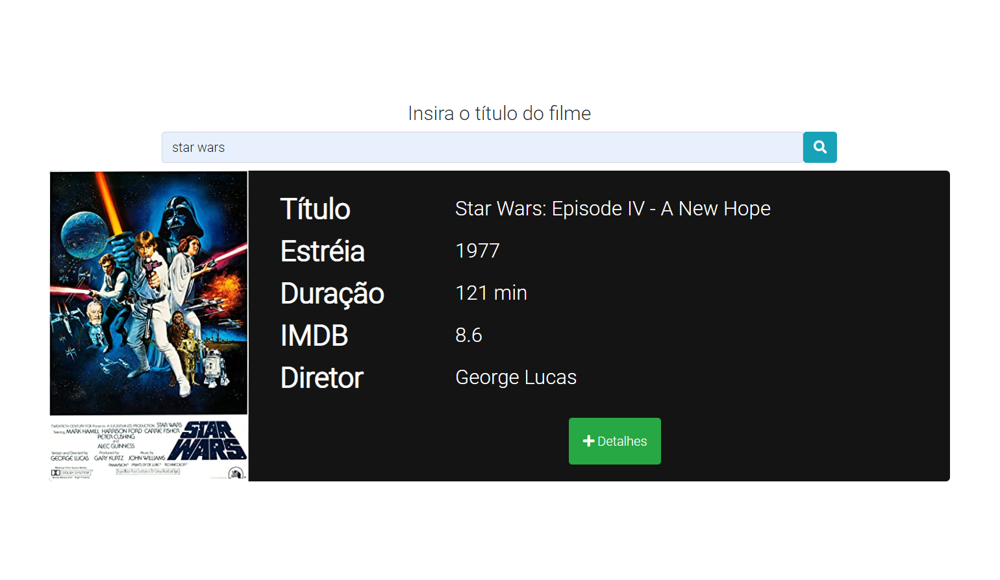

# BURH: Teste prático para Frontend

Teste prático para oportunidade de estágio na BURH (instruções em docs/instrucoes/README.md).

Link perfil : <https://burh.com.br/luizleite14>

## Você pode testá-lo live!!

[link teste](https://teste-burh-estagio.web.app/)

## OU

clone o repositório: 

## `git clone git@github.com:LuizJarduli/teste-burh-estagio.git`

execute o comando abaixo no terminal dentro do repositório clonado
## `npm install` 

Abra o arquivo _index.html_ e pronto, já está na aplicação.

## O que foi utilizado

- HTML5
- [jQuery 3.5.1](https://jquery.com/)
- Javascript
- CSS3
- [Live SASS Compiler](https://marketplace.visualstudio.com/items?itemName=ritwickdey.live-sass) (extensão do VSCODE para compilar SASS)
- [bootstrap 4.5.3](https://getbootstrap.com/docs/4.5/getting-started/download/)
## Estrutura Inicial

Estrutura inicial foi organizada nas seguintes pastas

Diretório | Função
:-------- | :-------
STYLE       | Todo o estilo da aplicação será armazenado aqui incluindo o css, scss etc. Importando o bootstrap no scss também
JS        | Todo código javascript será separado aqui
IMG       | possíveis imagens a serem utilizadas no projeto serão armazenadas aqui
DOCS      | Qualquer informação extra sobre o projeto será guardado aqui. EX: instruções iniciais.

## Diário de desenvolvimento
### Att 1:

Ideia inicial do primeiro dia era consumir a API do OMDB na página inicial. A _index.html_ recebe do usuário um título, via formulário, onde é utilizado AJAX no _main.js_ para fazer o _request_ na API.

quando o form recebe um _submit_ pelo usuário, uma requisição AJAX é feita.
Em caso de sucesso, a aplicação ja retorna alguns dados como:
- Título
- Ano de lançamento (estréia)
- Duração
- IMDB rating
- Diretor

### Att 2:

A página de detalhes da requisição (_filme.html_) feita na API foi inspirada no site <https://www.justwatch.com/>.

A ideia foi usar query String em javascript para conseguir pegar valores passados em GET pelo formulário inicial, e com isso não utilizar back-end na aplicação, mantendo o objetivo inicial do teste.

usando uma funçao no _onload_ da pág _filme.html_ foi possível, através de uma função auxiliar de parsing, recuperar a _query String_ e assim fazer uma requisição AJAX ao entrar nela.

### Att3:

Como utilizei o framework [bootstrap (mobile first)](https://getbootstrap.com/) no projeto, o uso de seu grid adiantou bastante a portabilidade para telas menores, exigindo muito pouco trabalho extra.

